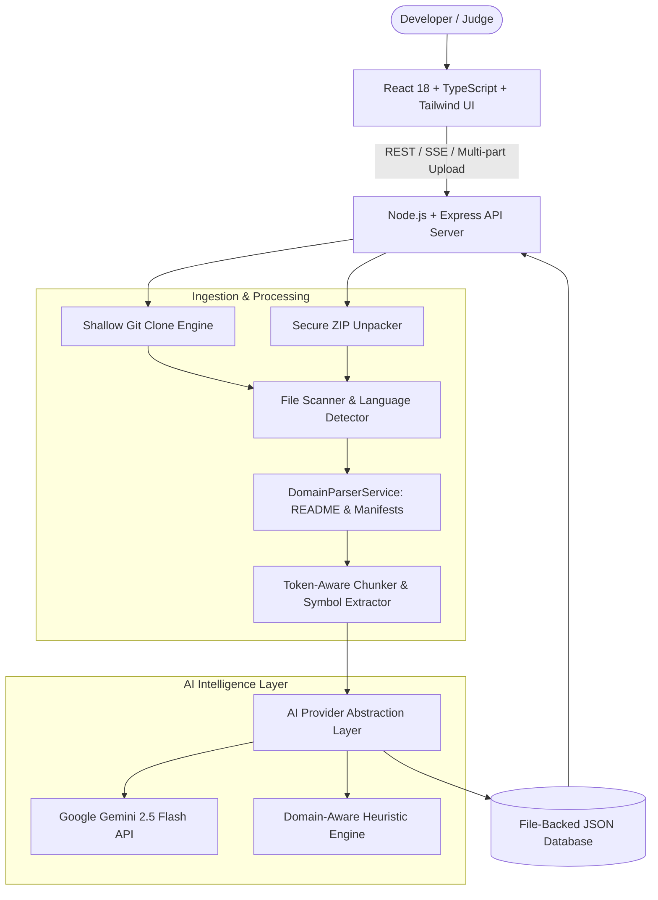

# 🔍 CodeLens AI

<div align="center">

**Understand any codebase in minutes, not days.**

An AI-powered developer intelligence platform that maps project architecture, audits code smells with unified diff fixes, generates unit tests, guides engineers through interactive onboarding journeys, and answers repository-grounded technical questions with exact code citations.

[](https://opensource.org/licenses/MIT)
[](https://www.typescriptlang.org/)
[](https://reactjs.org/)
[](https://vitejs.dev/)
[](https://tailwindcss.com/)
[](https://expressjs.com/)
[](https://ai.google.dev/)

</div>

---

## 💡 The Problem

Developers spend an average of **15–20 hours** attempting to comprehend unfamiliar codebases before shipping their first pull request. Reading raw directory trees, deciphering implicit data flows, hunting for unhandled edge cases, and figuring out local configurations slows down onboarding and stalls team velocity.

**CodeLens AI** eliminates this friction by ingesting any Git repository or ZIP archive and generating an interactive, visual, and grounded intelligence dashboard in seconds.

---

## ⚡ Key Capabilities

### 1. 🚀 Developer Onboarding Journey ("Understand This Codebase")
- **Interactive 7-Step Stepper**:
  1. 🎯 **Project Mission & Problem Statement**: Executive domain overview, architecture pattern, total lines of code, and codebase health score.
  2. ⚡ **Local Development Quick Start**: Prerequisites checklist, copyable environment variable schema table, and step-by-step setup commands.
  3. 🛠️ **Tech Stack & Architecture Rationale**: Why each language, framework, and database was selected.
  4. 🏛️ **Architecture & Mental Model Blueprint**: Decoupled component relationships and data flow pipeline.
  5. 📂 **Top 5 Essential Starter Files**: Ranked files with reasoning, key concepts, and 1-click code viewer inspection.
  6. 🔄 **End-to-End Execution Flow**: Step-by-step trace from client request through router, service handlers, database commits, and async events.
  7. 🗺️ **7-Day Contribution Roadmap & Comprehension Quiz**: Day-by-day contribution milestones and an interactive multi-question quiz with confetti rewards upon completion!
- **1-Click Export**: Download a ready-to-commit `ONBOARDING.md` guide.

---

### 2. 🗺️ Interactive Visual Architecture Map & Topology Graph
- **Component Topology Grid**: Visual cards representing Web Frontends, API Gateways, Microservices, Databases (PostgreSQL/Prisma), Caching (Redis), and External Gateways (Stripe, WebGPU workers).
- **Component Inspector**: Clicking any node displays its purpose, tech stack, and all constituent source files with 1-click file viewer triggers.
- **Data & Call Flow Connectors**: Explicit directional connections mapping HTTP calls, database queries, and async pub/sub events.
- **Language & Framework Analytics**: Multi-language percentage breakdown, line counts, and auto-detected entry points.

---

### 3. 🛡️ Code Insights & Unified Diff Fixer
- **Multi-Category Auditing**: Categorizes findings into **Bugs**, **Security Concerns**, **Performance Bottlenecks**, **Code Smells**, and **Complexity Hotspots**.
- **Real-Time Health Score**: Dynamic calculation (0–100) based on severity weights.
- **Unified Diff Patches**: View side-by-side or unified syntax-highlighted diffs proposing exact remediation code with 1-click **Copy Patch** and **Open File at Line** actions.

---

### 4. 🧪 Automated AI Unit Test Generator
- **Target File & Function Selection**: Select any source file or exported function from the codebase.
- **Multi-Framework Support**: Supports Vitest, Jest, PyTest, Mocha, and Go testing tools.
- **Comprehensive Test Suites**: Generates happy path assertions, null/boundary edge cases, and mocked dependency error handling.
- **Export**: 1-click **Copy Code** and **Download Spec File**.

---

### 5. 💬 Repository-Grounded AI Chat ("Ask CodeLens")
- **Deep Grounding**: Answers questions specifically verified against the repository's files, schemas, and routes.
- **Clickable Code Citations**: Every answer references exact file paths and line numbers (e.g. `[services/api-gateway/src/middleware/auth.ts:L4]`) that open the file directly in the viewer.
- **Quick Prompt Chips**: Instant suggestions for common questions ("How does authentication work?", "Where is user login?", "Explain checkout flow").

---

### 6. ⚡ Multi-Provider AI Abstraction & Instant Demo Mode
- **Configurable AI Pipeline**: Supports **Google Gemini 2.5 Flash** via API key or a built-in **Domain-Aware Heuristic Intelligence Engine** that deeply parses `README.md`, `manifest.json`, and AST symbols for offline use.
- **1-Click Demo Mode**: Pre-loaded with **ShopSphere Cloud** (an authentic full-stack microservices e-commerce application) for instant demonstration without API keys or cloning wait times.
- **Security Guardrails**: Safe Git shallow cloning (`--depth 1`), Zip-Slip path traversal protection, file size/count limits, and automatic ignore filters (`node_modules`, `.git`, binaries).

---

## 🏗️ System Architecture



---

## 🛠️ Tech Stack

| Layer | Technologies |
| :--- | :--- |
| **Frontend UI** | React 18, Vite 6, TypeScript, Tailwind CSS, Lucide Icons, Canvas Confetti |
| **Backend Server** | Node.js (ES2022), Express, TypeScript, Multer, simple-git, adm-zip |
| **AI Layer** | Google Gemini 2.5 / 1.5 Flash API, Domain-Aware Heuristic Engine |
| **Data Storage** | Disk-persisted JSON file store (`data/codelens_db.json`) |
| **Monorepo Tooling** | Concurrently, NPM Workspaces |

---

## 🚀 Quick Start

### Prerequisites

- **Node.js** `>= 18.0.0`
- **npm** `>= 9.0.0` (or `pnpm` / `yarn`)
- **Git** installed

---

### Installation & Setup

1. **Clone the repository**:
   ```bash
   git clone https://github.com/Pranav00076/CodeLens.git
   cd CodeLens
   ```

2. **Install all dependencies** (installs root, client, and server dependencies):
   ```bash
   npm run install:all
   ```

3. **Configure Environment Variables** (Optional):
   ```bash
   # In server/.env
   PORT=5001
   GEMINI_API_KEY=your_gemini_api_key_here  # Optional: defaults to offline heuristic engine if omitted
   ```
   > 💡 *Note: You can also configure your Gemini API Key directly inside the app UI via the Key (<kbd>🔑</kbd>) settings button in the top navigation bar!*

4. **Start the application**:
   ```bash
   npm run dev
   ```

5. **Open in your browser**:
   - 🌐 **Frontend UI**: [http://localhost:5174/](http://localhost:5174/)
   - ⚡ **Backend API Health**: [http://localhost:5001/api/health](http://localhost:5001/api/health)

---

## 📡 API Reference

| Method | Endpoint | Description |
| :--- | :--- | :--- |
| `GET` | `/api/health` | System health check and active AI provider status |
| `GET` | `/api/analyze/demo` | Loads the instant microservices demo repository |
| `POST` | `/api/analyze/github` | Clones and analyzes a public GitHub repository URL |
| `POST` | `/api/analyze/upload` | Uploads and analyzes a ZIP repository archive |
| `GET` | `/api/repos/:id` | Returns full repository metadata, file tree, architecture, and issues |
| `GET` | `/api/repos/:id/file?path=...` | Returns syntax-highlighted file contents with line counts |
| `GET` | `/api/repos/:id/export/onboarding` | Downloads a structured `ONBOARDING.md` guide |
| `POST` | `/api/repos/:id/chat` | Grounded AI Q&A with file and line citations |
| `POST` | `/api/repos/:id/tests/generate` | Generates runnable unit test suites for a file or function |
| `POST` | `/api/config/apikey` | Sets or resets the active Gemini API Key dynamically |

---

## 🛡️ Security & Privacy Guarantees

- **Path Traversal Protection**: File requests validate paths against repository root boundaries to prevent directory escape (`../`).
- **Zip-Slip Defense**: Archive extraction normalizes target paths and rejects entries containing directory traversal sequences.
- **Resource Limits**: Automatic exclusion of `node_modules`, `.git`, `.next`, `.turbo`, and binary media files prevents memory bloat and protects throughput.
- **Shallow Cloning**: Git ingestion uses `--depth 1` shallow clones with timeout guards to minimize bandwidth and storage overhead.

---

## 📄 License

Distributed under the **MIT License**. See `LICENSE` for more information.

---

<div align="center">

Built with ❤️ for Developers by [Pranav Thawait](https://github.com/Pranav00076)

</div>